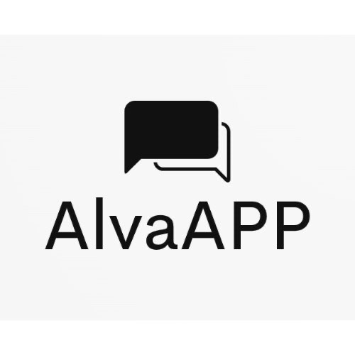

# Hey, I'm Diego
### Bachelor's in Computer Science

###
#  About Me:
 Passionate about technology, soccer, Formula 1.  Currently studying Computer Science at Inteli.  Always learning something new, and right now I’m learning about Optimization

#  Tech Stack:
         
<!-- Proudly created with GPRM ( https://gprm.itsvg.in ) -->

## Companies I’ve developed projects for
These are some of the companies and organizations I’ve created projects for as part of my portfolio.  

<table align="center" style="margin: 0 auto; border-spacing: 16px; text-align: center;">
  <tr>
    <td style="text-align: center;">
      
       
      <strong>Project:</strong> Security
    </td>
    <td style="text-align: center;">
      
       
      <strong>Project:</strong> Lead page</td>
    <td style="text-align: center;">
      
       
      <strong>Project:</strong> Game
    </td>
    <td style="text-align: center;">
      
       
      <strong>Project:</strong> Web Application
    </td>
    <td style="text-align: center;">
      
       
      <strong>Project:</strong> Predictive Model
    </td>
    <td style="text-align: center;">
      
       
      <strong>Project:</strong> IoT Model
    </td>
    <td style="text-align: center;">
      
       
      <strong>Project:</strong> Graphs
    </td>
    <td style="text-align: center;">
      
       
      <strong>Project:</strong> Algorythms
    </td>
  </tr>
</table>
