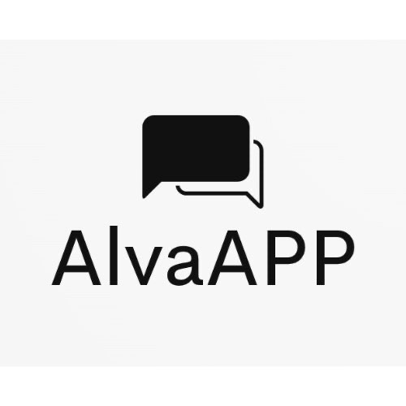

# Hey, I'm Diego
### Bachelor's in Computer Science

###
#  About Me:
 Passionate about technology, soccer, formula 1.  Currently studying Computer Science at Inteli.  Always learning something new, and right now I’m learning about AWS

### Tech Stack

  

<!-- Proudly created with GPRM ( https://gprm.itsvg.in ) -->

### Companies I’ve developed projects for
These are some of the companies and organizations I’ve created projects for as part of my portfolio.  
<table align="center">
<tr>

<td align="center" valign="top" width="140">

 
<b>Project:</b> Security
</td>

<td align="center" valign="top" width="140">

 
<b>Project:</b> Lead Page
</td>

<td align="center" valign="top" width="140">

 
<b>Project:</b> Game
</td>

<td align="center" valign="top" width="140">

 
<b>Project:</b> Web Application
</td>

<td align="center" valign="top" width="140">

 
<b>Project:</b> Predictive Model
</td>

<td align="center" valign="top" width="140">

 
<b>Project:</b> IoT Model
</td>

<td align="center" valign="top" width="140">

 
<b>Project:</b> Graphs
</td>

<td align="center" valign="top" width="140">

 
<b>Project:</b> Algorithms
</td>

<td align="center" valign="top" width="140">

 
<b>Project:</b> AWS Project
</td>

<td align="center" valign="top" width="140">

 
<b>Project:</b> ML Research
</td>

</tr>
</table>

